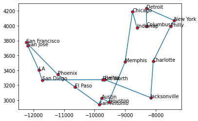
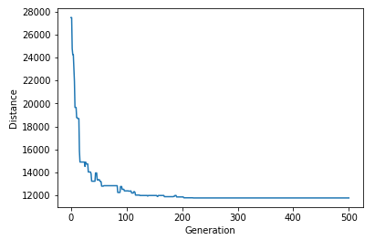

# Traveling-Salesman-Problem (GENETIC ALGORITHIM)

#### What is the Traveling Salesman Problem? 

“Given a list of cities and the distances between each pair of cities, what is the shortest possible route that visits each city and returns to the origin city?” 

## What is the Genetic Algorithm? 

A genetic algorithm is a search heuristic that is inspired by Charles Darwin’s theory of natural evolution. This algorithm reflects the process of natural selection where the fittest individuals are selected for reproduction to produce offspring of the next generation. 

#### Time Complexity of Genetic Algorithm: 

* Genetic Algorithm is an optimization algorithm used to solve non-linear problems, to compute the shortest route in a few seconds (**O(ng)**, where n is population size and g is number of generations). _If this attempted through brute force it would have been impractical with a time complexity of O(n!)._

## Results and interesting findings: 

**This is the shortest calculated route plotted:**

 

**The difference between the initial distance and final distance:**

Initial distance: 27563.288009700773

Final distance: 11593.874222707302 

**Difference**: 15969.41379

Total Distance vs Generations

